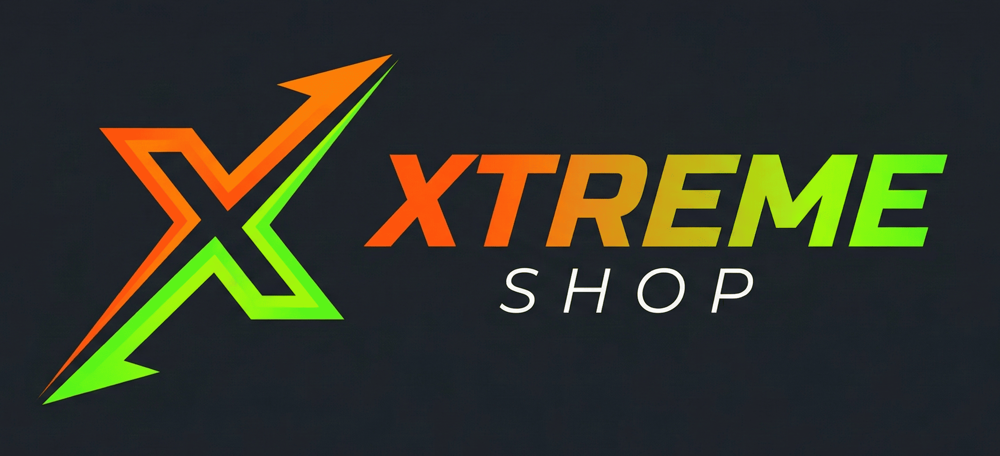

🚀 Xtreme Shop

<b>Sistema de Ventas Full Stack de Alto Rendimiento</b>

📝 Resumen del Proyecto

Xtreme Shop es una aplicación Single Page Application (SPA) diseñada para gestionar inventarios y ventas en tiempo real. Este proyecto es una pieza clave en mi formación como desarrollador en el grado DAW, donde aplico arquitecturas modernas y escalables.

🎓 Créditos: Este proyecto está siendo desarrollado bajo la guía del curso experto de Código 369, integrando mejoras para darle un toque personal.

🛠️ Stack Tecnológico

<table align="center">
<tr>
<td align="center" width="200">

<b>React + Vite</b>
</td>
<td align="center" width="200">

<b>Tailwind CSS</b>
</td>
<td align="center" width="200">

<b>PostgreSQL</b>
</td>
<td align="center" width="200">

<b>Supabase BaaS</b>
</td>
</tr>
</table>

🎯 Funcionalidades Principales

- Arquitectura Modular: Organización por capas siguiendo el estándar de la industria.

- Base de Datos Pro: Esquema relacional optimizado en PostgreSQL.

- Seguridad Extrema: Implementación de Row Level Security (RLS).

- Dashboard en Tiempo Real: Visualización de métricas con analíticas integradas.

- Auth Multi-nivel: Roles de administrador y vendedor.

⚙️ Configuración del Entorno

Si deseas replicar este sistema en tu entorno local, sigue estos pasos:

- Clonación segura

git clone https://github.com/TU-USUARIO-GITHUB/xtreme-shop.git

- Instalación de dependencias

npm install

- Variables de Entorno (.env.local):

VITE_SUPABASE_URL=TU_PROYECTO_URL
VITE_SUPABASE_ANON_KEY=TU_CLAVE_ANONIMA

- Modo Desarrollo:

npm run dev

Desarrollado con pasión por <a href="https://github.com/DaniQB99"><b>Daniel Quirós</b></a>

Estudiante de DAW en la Universidad Alfonso X el Sabio

 

